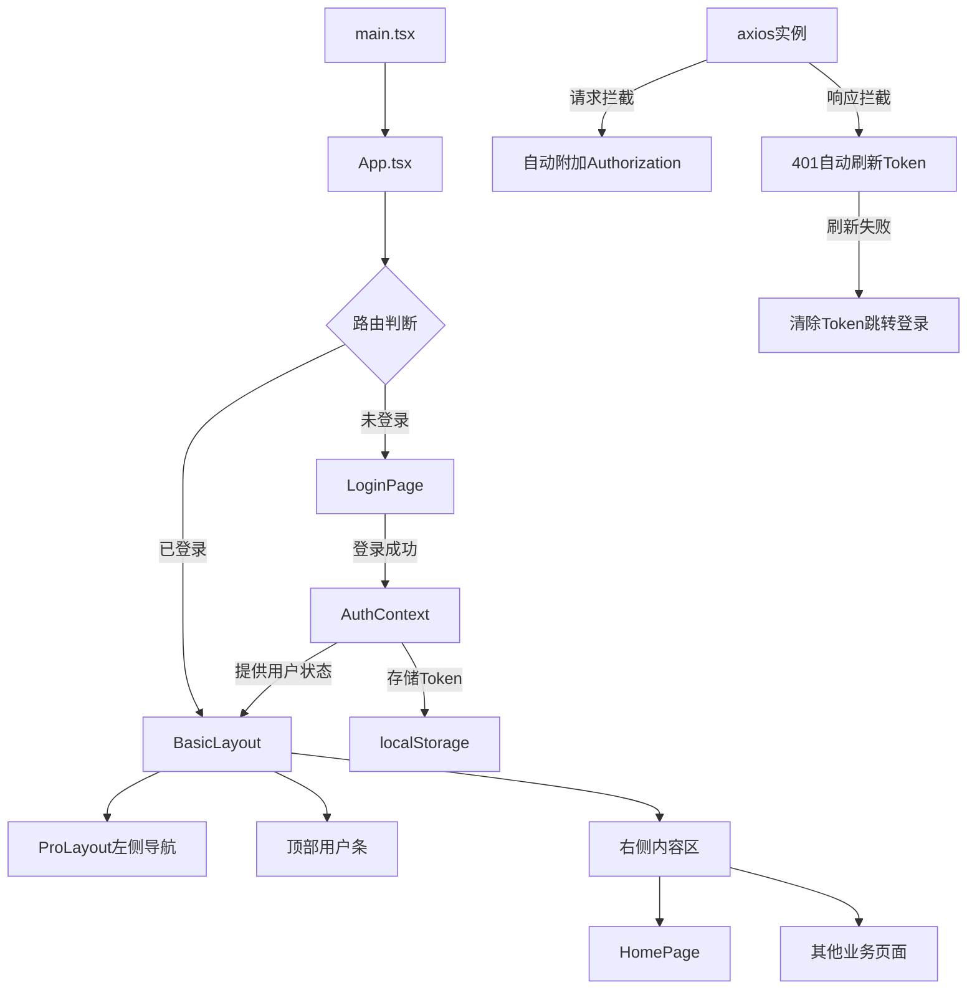

## 用户需求

基于JWT双Token认证API文档，在antd-admin项目中实现完整的认证系统和主布局。

## 功能内容

1. **生成计划文档**：在 `docs/jwt-plan-mimo.md` 中输出完整的实施计划，包含API文档、数据结构、实现方案
2. **登录页面**：使用 antd/pro-components 现成组件实现用户名+密码登录表单，调用 `/auth/login` 接口
3. **Home页布局**：

- 左侧导航栏：使用 ProLayout 的菜单系统
- 顶部用户条：显示当前登录用户名，右侧提供登出操作
- 右侧内容区：主内容展示区域

4. **登出功能**：调用 `/auth/logout` 接口，清除本地Token，跳转回登录页
5. **Token管理**：存储accessToken和refreshToken，实现自动刷新Token的拦截器
6. **路由守卫**：未登录时自动跳转登录页，已登录时禁止访问登录页

## 约束条件

- 必须使用 antd 或 @ant-design/pro-components 现成组件
- 禁止自定义组件（但可以封装antd/antd-pro组件）
- 后端API地址：`http://localhost:8080`

## 技术栈

- **前端框架**：React 19 + TypeScript 6
- **构建工具**：Vite 8
- **UI组件库**：antd 6 + @ant-design/pro-components 2 + @ant-design/icons 6
- **路由**：react-router-dom v7（需安装）
- **HTTP客户端**：axios（需安装）
- **状态管理**：React Context（无需额外依赖）
- **包管理器**：pnpm

## 技术架构

### 系统架构



### 模块划分

1. **类型定义层** (`src/types/`)：API请求/响应的TypeScript类型
2. **工具层** (`src/utils/`)：axios实例封装，Token读写工具
3. **服务层** (`src/services/`)：API调用函数
4. **状态层** (`src/context/`)：AuthContext管理认证状态
5. **布局层** (`src/layouts/`)：ProLayout封装的主布局
6. **页面层** (`src/pages/`)：LoginPage、HomePage
7. **路由层** (`src/router/`)：路由配置和守卫

### 数据流

```
用户输入 -> LoginForm -> authService.login() -> axios.post(/auth/login) 
-> 响应成功 -> AuthContext.setAuth(accessToken, refreshToken) 
-> localStorage存储 -> 路由跳转到Home页
```

### 关键设计决策

1. **使用React Context而非Redux/Zustand**：认证状态简单，Context足够，避免引入额外依赖
2. **使用ProLayout**：内置侧边栏导航+顶部栏+内容区布局，满足需求且高度可配置
3. **axios拦截器实现Token刷新**：401响应时自动用refreshToken换取新token，失败则登出
4. **路由守卫组件**：封装一个RouteGuard组件，统一处理认证检查

### 需要新增的依赖

```
{
  "react-router-dom": "^7.x",
  "axios": "^1.x"
}
```

## 设计风格

采用 Ant Design Pro 默认的企业级管理后台设计风格，使用 ProLayout 提供的标准布局。

### 登录页

- 居中卡片式登录表单，使用 antd Card + Form 组件
- 用户名和密码输入框，带验证规则
- 登录按钮，带loading状态
- 页面背景使用浅灰色渐变

### Home页布局

- **左侧导航栏**：ProLayout 自带的侧边菜单，支持折叠
- **顶部用户条**：ProLayout 右上角区域，显示用户名 + Dropdown菜单（含登出选项）
- **右侧内容区**：路由出口，展示各业务页面内容