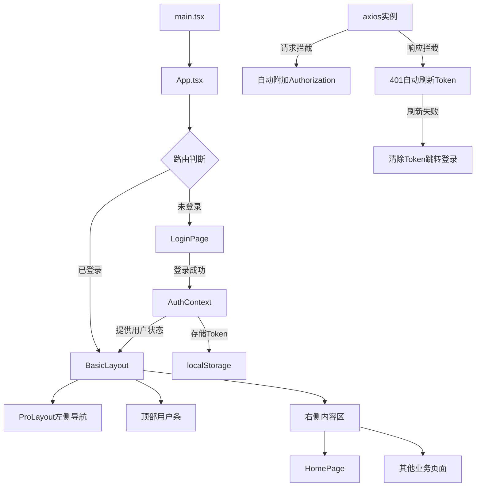

# JWT 双 Token 认证实现计划

## 用户需求

基于JWT双Token认证API文档，在antd-admin项目中实现完整的认证系统和主布局。

## 功能内容

1. **生成计划文档**：在 `docs/jwt-plan-mimo.md` 中输出完整的实施计划，包含API文档、数据结构、实现方案
2. **登录页面**：使用 antd/pro-components 现成组件实现用户名+密码登录表单，调用 `/auth/login` 接口
3. **Home页布局**：

- 左侧导航栏：使用 ProLayout 的菜单系统
- 顶部用户条：显示当前登录用户名，右侧提供登出操作
- 右侧内容区：主内容展示区域

4. **登出功能**：调用 `/auth/logout` 接口，清除本地Token，跳转回登录页
5. **Token管理**：存储accessToken和refreshToken，实现自动刷新Token的拦截器
6. **路由守卫**：未登录时自动跳转登录页，已登录时禁止访问登录页

## 约束条件

- 必须使用 antd 或 @ant-design/pro-components 现成组件
- 禁止自定义组件（但可以封装antd/antd-pro组件）
- 后端API地址：`http://localhost:8080`

## API 文档

### OpenAPI 3.0 规范

```json
{"openapi":"3.0.1","info":{"title":"JWT 双 Token 认证 API","description":"基于 Spring Security + JWT 的双 Token（Access + Refresh）认证接口文档","contact":{"name":"jwt-java-eight"},"version":"1.0.0"},"servers":[{"url":"http://localhost:8080","description":"Generated server url"}],"security":[{"Bearer Token":[]}],"tags":[{"name":"认证管理","description":"登录、刷新Token、登出接口"}],"paths":{"/auth/unlock/{userId}":{"post":{"tags":["认证管理"],"summary":"解锁用户账户","description":"管理员解锁被锁定的用户账户，重置登录失败次数","operationId":"unlockUser","parameters":[{"name":"userId","in":"path","required":true,"schema":{"type":"integer","format":"int64"}}],"responses":{"200":{"description":"OK","content":{"*/*":{"schema":{"$ref":"#/components/schemas/ResultVoid"}}}}}}},"/auth/register":{"post":{"tags":["认证管理"],"summary":"用户注册","description":"注册新用户账号","operationId":"register","requestBody":{"content":{"application/json":{"schema":{"$ref":"#/components/schemas/RegisterRequest"}}},"required":true},"responses":{"200":{"description":"OK","content":{"*/*":{"schema":{"$ref":"#/components/schemas/ResultVoid"}}}}}}},"/auth/refresh":{"post":{"tags":["认证管理"],"summary":"刷新Token","description":"使用 Refresh Token 换取新的 Access Token 和 Refresh Token","operationId":"refresh","requestBody":{"content":{"application/json":{"schema":{"$ref":"#/components/schemas/RefreshRequest"}}},"required":true},"responses":{"200":{"description":"OK","content":{"*/*":{"schema":{"$ref":"#/components/schemas/ResultLoginResponse"}}}}}}},"/auth/logout":{"post":{"tags":["认证管理"],"summary":"用户登出","description":"清除当前用户的 Refresh Token 记录","operationId":"logout","requestBody":{"content":{"application/json":{"schema":{"$ref":"#/components/schemas/JwtUserDetails"}}}},"responses":{"200":{"description":"OK","content":{"*/*":{"schema":{"$ref":"#/components/schemas/ResultVoid"}}}}},"security":[{"Bearer Token":[]}]}},"/auth/login":{"post":{"tags":["认证管理"],"summary":"用户登录","description":"用户名+密码登录，返回 Access Token 和 Refresh Token。注意：实际请求由 JwtLoginFilter 在 Filter 链中拦截处理，此接口仅用于 Swagger 文档展示","operationId":"login","requestBody":{"content":{"application/json":{"schema":{"$ref":"#/components/schemas/LoginRequest"}}},"required":true},"responses":{"200":{"description":"OK","content":{"*/*":{"schema":{"$ref":"#/components/schemas/ResultLoginResponse"}}}}}}}},"components":{"schemas":{"ResultVoid":{"type":"object","properties":{"code":{"type":"integer","format":"int32"},"message":{"type":"string"},"data":{"type":"object"}}},"RegisterRequest":{"required":["password","username"],"type":"object","properties":{"username":{"maxLength":20,"minLength":3,"pattern":"^[a-zA-Z0-9_]+$","type":"string","description":"用户名","example":"testuser"},"password":{"maxLength":20,"minLength":6,"type":"string","description":"密码","example":"123456"}},"description":"用户注册请求参数"},"RefreshRequest":{"required":["refreshToken"],"type":"object","properties":{"refreshToken":{"type":"string","description":"刷新令牌"}},"description":"刷新Token请求参数"},"LoginResponse":{"type":"object","properties":{"accessToken":{"type":"string","description":"访问令牌"},"refreshToken":{"type":"string","description":"刷新令牌"},"tokenType":{"type":"string","description":"令牌类型","example":"Bearer"}},"description":"登录/刷新响应结果"},"ResultLoginResponse":{"type":"object","properties":{"code":{"type":"integer","format":"int32"},"message":{"type":"string"},"data":{"$ref":"#/components/schemas/LoginResponse"}}},"GrantedAuthority":{"type":"object","properties":{"authority":{"type":"string"}}},"JwtUserDetails":{"type":"object","properties":{"userId":{"type":"integer","format":"int64"},"username":{"type":"string"},"password":{"type":"string"},"enabled":{"type":"boolean"},"authorities":{"type":"array","items":{"$ref":"#/components/schemas/GrantedAuthority"}},"accountNonExpired":{"type":"boolean"},"credentialsNonExpired":{"type":"boolean"},"accountNonLocked":{"type":"boolean"}}},"LoginRequest":{"required":["password","username"],"type":"object","properties":{"username":{"type":"string","description":"用户名","example":"admin"},"password":{"type":"string","description":"密码","example":"123456"}},"description":"登录请求参数"}},"securitySchemes":{"Bearer Token":{"type":"http","scheme":"bearer","bearerFormat":"JWT"}}}}
```

### 数据对象结构 (Schemas)

```json
{"title":"项目数据对象结构 (Schemas)","totalCount":8,"schemas":{"ResultVoid":{"type":"object","properties":{"code":{"type":"integer","format":"int32"},"message":{"type":"string"},"data":{"type":"object"}}},"RegisterRequest":{"required":["password","username"],"type":"object","properties":{"username":{"maxLength":20,"minLength":3,"pattern":"^[a-zA-Z0-9_]+$","type":"string","description":"用户名","example":"testuser"},"password":{"maxLength":20,"minLength":6,"type":"string","description":"密码","example":"123456"}},"description":"用户注册请求参数"},"RefreshRequest":{"required":["refreshToken"],"type":"object","properties":{"refreshToken":{"type":"string","description":"刷新令牌"}},"description":"刷新Token请求参数"},"LoginResponse":{"type":"object","properties":{"accessToken":{"type":"string","description":"访问令牌"},"refreshToken":{"type":"string","description":"刷新令牌"},"tokenType":{"type":"string","description":"令牌类型","example":"Bearer"}},"description":"登录/刷新响应结果"},"ResultLoginResponse":{"type":"object","properties":{"code":{"type":"integer","format":"int32"},"message":{"type":"string"},"data":{"$ref":"#/components/schemas/LoginResponse"}}},"GrantedAuthority":{"type":"object","properties":{"authority":{"type":"string"}}},"JwtUserDetails":{"type":"object","properties":{"userId":{"type":"integer","format":"int64"},"username":{"type":"string"},"password":{"type":"string"},"enabled":{"type":"boolean"},"accountNonLocked":{"type":"boolean"},"authorities":{"type":"array","items":{"$ref":"#/components/schemas/GrantedAuthority"}},"credentialsNonExpired":{"type":"boolean"},"accountNonExpired":{"type":"boolean"}}},"LoginRequest":{"required":["password","username"],"type":"object","properties":{"username":{"type":"string","description":"用户名","example":"admin"},"password":{"type":"string","description":"密码","example":"123456"}},"description":"登录请求参数"}},"usage":"复制 schemas 字段内容给 AI，让其了解项目的数据结构"}
```

## 技术栈

- **前端框架**：React 19 + TypeScript 6
- **构建工具**：Vite 8
- **UI组件库**：antd 6 + @ant-design/pro-components 2 + @ant-design/icons 6
- **路由**：react-router-dom v7（需安装）
- **HTTP客户端**：axios（需安装）
- **状态管理**：React Context（无需额外依赖）
- **包管理器**：pnpm

## 技术架构

### 系统架构



### 模块划分

1. **类型定义层** (`src/types/`)：API请求/响应的TypeScript类型
2. **工具层** (`src/utils/`)：axios实例封装，Token读写工具
3. **服务层** (`src/services/`)：API调用函数
4. **状态层** (`src/context/`)：AuthContext管理认证状态
5. **布局层** (`src/layouts/`)：ProLayout封装的主布局
6. **页面层** (`src/pages/`)：LoginPage、HomePage
7. **路由层** (`src/router/`)：路由配置和守卫

### 数据流

```
用户输入 -> LoginForm -> authService.login() -> axios.post(/auth/login) 
-> 响应成功 -> AuthContext.setAuth(accessToken, refreshToken) 
-> localStorage存储 -> 路由跳转到Home页
```

### 关键设计决策

1. **使用React Context而非Redux/Zustand**：认证状态简单，Context足够，避免引入额外依赖
2. **使用ProLayout**：内置侧边栏导航+顶部栏+内容区布局，满足需求且高度可配置
3. **axios拦截器实现Token刷新**：401响应时自动用refreshToken换取新token，失败则登出
4. **路由守卫组件**：封装一个RouteGuard组件，统一处理认证检查

### 需要新增的依赖

```json
{
  "react-router-dom": "^7.x",
  "axios": "^1.x"
}
```

## 设计风格

采用 Ant Design Pro 默认的企业级管理后台设计风格，使用 ProLayout 提供的标准布局。

### 登录页

- 居中卡片式登录表单，使用 antd Card + Form 组件
- 用户名和密码输入框，带验证规则
- 登录按钮，带loading状态
- 页面背景使用浅灰色渐变

### Home页布局

- **左侧导航栏**：ProLayout 自带的侧边菜单，支持折叠
- **顶部用户条**：ProLayout 右上角区域，显示用户名 + Dropdown菜单（含登出选项）
- **右侧内容区**：路由出口，展示各业务页面内容

## 实现步骤

### 第一步：安装依赖

```bash
pnpm add react-router-dom axios
```

### 第二步：创建类型定义

创建 `src/types/auth.ts`，定义API请求/响应的TypeScript类型。

### 第三步：创建请求工具

创建 `src/utils/request.ts`，封装axios实例，包含：
- 请求拦截器：自动附加Authorization头
- 响应拦截器：处理401错误，自动刷新Token
- Token刷新逻辑：使用refreshToken获取新token

### 第四步：创建认证服务

创建 `src/services/auth.ts`，实现以下API调用：
- `login(username, password)` - 用户登录
- `logout()` - 用户登出
- `refresh(refreshToken)` - 刷新Token

### 第五步：创建认证上下文

创建 `src/context/AuthContext.tsx`，管理认证状态：
- 用户信息
- accessToken和refreshToken
- 登录/登出方法
- Token存储到localStorage

### 第六步：创建登录页面

创建 `src/pages/Login/index.tsx`，使用antd组件：
- Card组件作为容器
- Form组件实现登录表单
- Input组件用于用户名和密码输入
- Button组件用于提交

### 第七步：创建主布局

创建 `src/layouts/BasicLayout.tsx`，使用ProLayout组件：
- 左侧导航菜单
- 顶部用户条（显示用户名和登出按钮）
- 右侧内容区域

### 第八步：创建首页

创建 `src/pages/Home/index.tsx`，作为默认首页内容。

### 第九步：配置路由

修改 `src/App.tsx`，配置路由：
- 登录路由：`/login`
- 受保护路由：`/`（重定向到首页）
- 路由守卫：未登录时重定向到登录页

### 第十步：更新入口文件

修改 `src/main.tsx`，移除旧样式引用，确保入口正确。

## 注意事项

1. **Token存储**：使用localStorage存储accessToken和refreshToken
2. **Token刷新**：实现自动刷新逻辑，避免用户频繁登录
3. **错误处理**：统一处理API错误，显示友好的错误信息
4. **安全性**：不在前端存储敏感信息，Token通过HTTP头传输
5. **用户体验**：登录状态持久化，页面刷新后保持登录状态